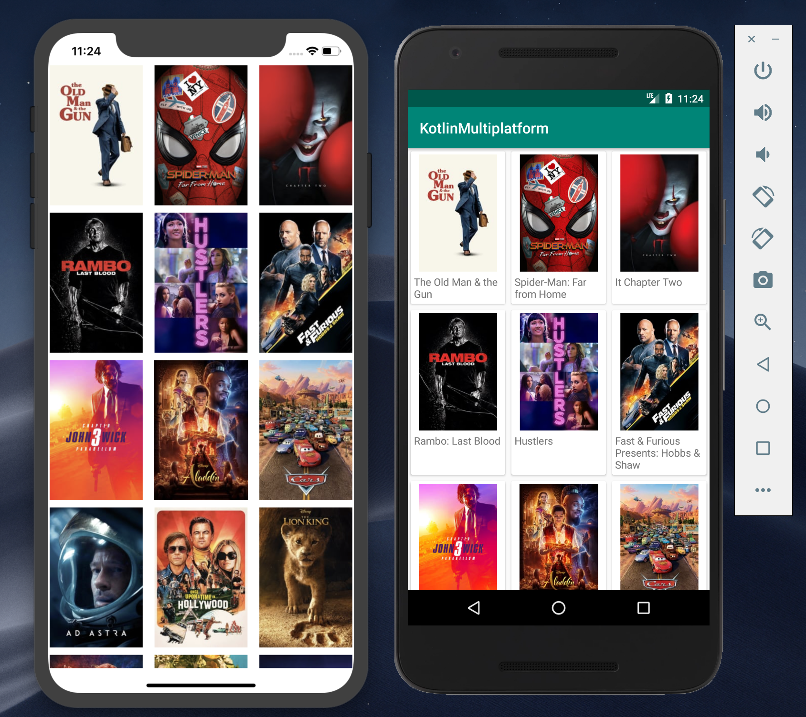

# KotlinMultiplatform: Android e iOS apps

Proyecto de ejemplo que usa Kotlin Native para consumir Rest<br>
La app Android está construida con **Kotlin** <br>
La app iOS está construida con **Swift** <br>

## Requerimientos

- Api Rest: Kotlin Native
- Android: Kotlin, **Android 5+ (API 21+)**<br>
- iOS: Swift4+

## Uso

Consumiendo un servicio en Android
``` kotlin
private fun loadList() {
        movieApi.getMovieList(
            success = {
                launch(Main) {
                    android.util.Log.i("z- data", it.toString())
                }
            },
            failure = ::handleError
        )
    }
```

Consumiendo un servicio en iOS 
```swift
private func loadList(){
        movieApi.getMovieList(
            success: { data in
                print(data)
                return KotlinUnit()
        }, failure: {
            self.handleError($0?.message)
            return KotlinUnit()
        })
    }
```  

<p align="center">
  
</p>

## Dependencias  

- [Ktor](https://ktor.io/clients/http-client/multiplatform.html)
- [KotlinX.Serialization](https://github.com/Kotlin/kotlinx.serialization)
- [KotlinX.Coroutines](https://github.com/Kotlin/kotlinx.coroutines)

 
  <br>  
  <br>  
*Happy coding!*